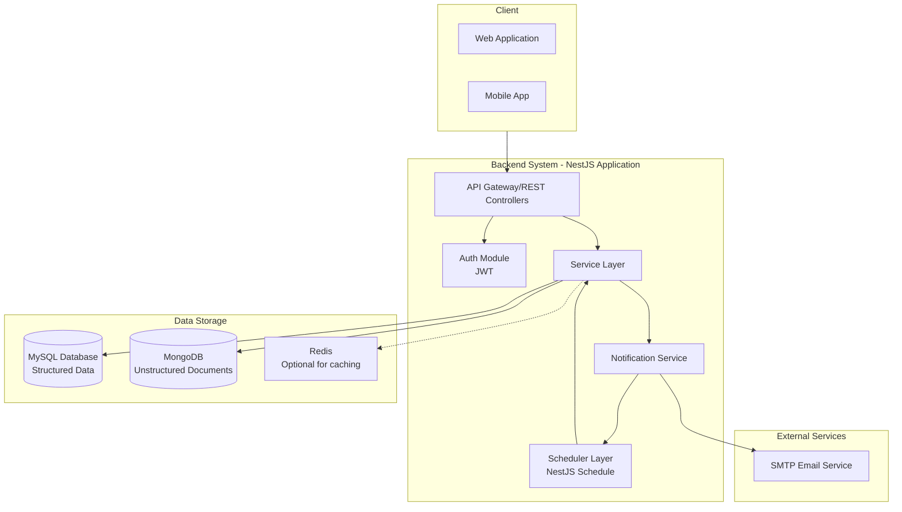
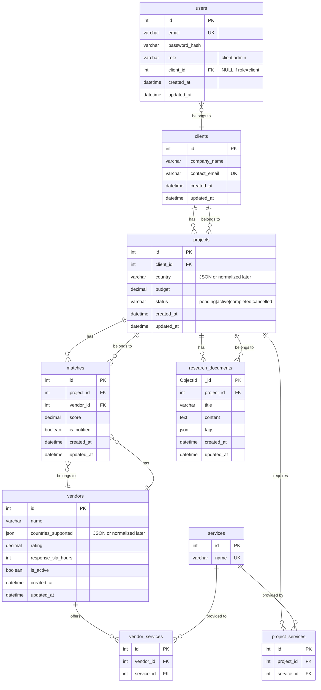
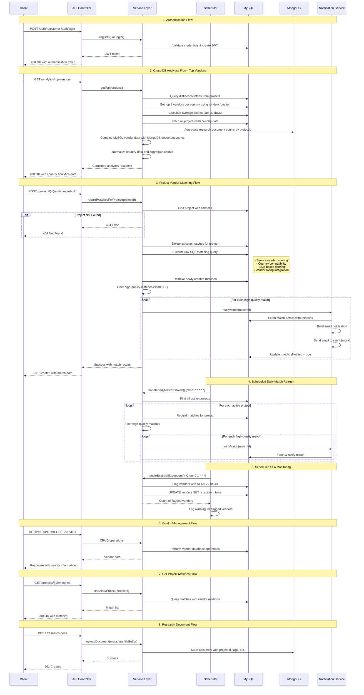
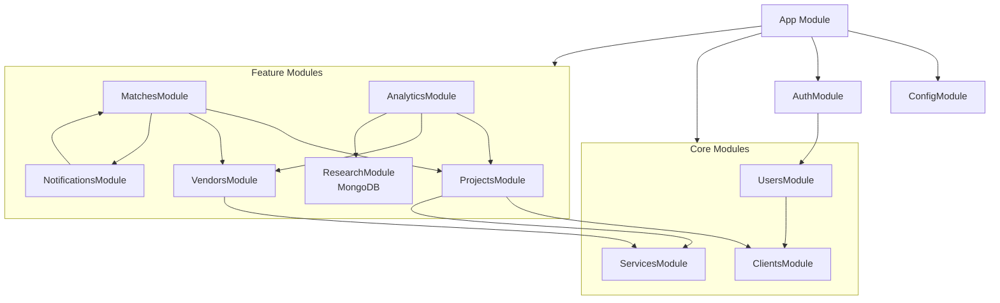

## 1. System Architecture Diagram

This diagram shows the high-level components of the system, their interactions, and the technology stack.



---

## 2. Relational Database (MySQL) Schema Diagram



## 📖 Database Design Description

This database schema is designed to manage **clients, projects, vendors, and their matching process** within the system. It follows a **relational model** using MySQL, with some integrations to MongoDB for unstructured data.

### 🔹 Entities & Relationships

- **Users**:
  Represent system users (clients and admins). Each user is linked to a `client` record if their role is `client`.

- **Clients**:
  Companies or organizations that create projects.
  - A client **has many** projects.

- **Projects**:
  Requests submitted by clients, containing budget, status, and required services.
  - A project **belongs to** one client.
  - A project **requires many** services (via `project_services`).
  - A project **has many** matches with vendors.
  - A project **has many** research documents (stored in MongoDB).

- **Vendors**:
  Service providers that support multiple countries and offer various services.
  - A vendor **offers many** services (via `vendor_services`).
  - A vendor **has many** matches with projects.

- **Services**:
  Standardized list of services offered in the system.
  - A service **is required by many** projects.
  - A service **is offered by many** vendors.

- **Project_Services / Vendor_Services**:
  Many-to-many join tables connecting projects and vendors to the services they need or provide.

- **Matches**:
  Represent the result of the matching logic between a project and a vendor, including the score and notification status.
  - A match **belongs to** one project.
  - A match **belongs to** one vendor.

- **Research_Documents (MongoDB)**:
  Unstructured documents related to projects (e.g., market research, analysis reports). They are stored in MongoDB with flexible schema (tags, text content, etc.).

### 🔹 Design Considerations

- **Services Normalization**: Services are stored in a dedicated table to ensure data integrity and enable efficient querying (e.g., finding all vendors offering a service needed by a project).
- **Countries**: Currently stored as JSON for simplicity, but can be normalized into separate tables if more advanced querying or analytics are required.
- **Hybrid Approach**: Relational data (projects, vendors, matches) is kept in MySQL for strong consistency, while research documents are stored in MongoDB to support flexible and scalable document storage.

📌 This structure provides a clean separation of concerns, supports scalable matching logic, and ensures efficient queries for both transactional operations and analytics.

---

## 3. API Endpoints & Flow Diagram

### Key API Endpoints

#### Authentication Endpoints

```typescript
POST /auth/register     # Client account registration
POST /auth/login        # User authentication
```

#### Analytics Endpoints

```typescript
GET /analytics/top-vendors  # Get top vendors by country with document counts
```

#### Project Matching Endpoints

```typescript
POST /projects/:projectId/matches/rebuild  # Rebuild vendor matches for a project
GET /projects/:projectId/matches           # Get matches for a project
```

#### Research Document Endpoints

```typescript
POST /research-docs          # Upload research documents
```

### Comprehensive Flow Diagram



### Top Vendors Analytics Endpoint Details

The `GET /analytics/top-vendors` endpoint implements a sophisticated cross-database analytics solution:

#### Data Flow Architecture

1. **Country Extraction**: Query distinct countries from MySQL projects table
2. **Vendor Ranking**: Use window functions to rank top 3 vendors per country by average match score
3. **Document Aggregation**: Count research documents in MongoDB grouped by projectId
4. **Data Combination**: Merge vendor performance data with research document counts
5. **Country Normalization**: Handle both string and array country formats

#### SQL Window Function Implementation

```sql
WITH ranked_vendors AS (
  SELECT
    JSON_UNQUOTE(p.country) as country,
    v.id as vendor_id,
    v.name as vendor_name,
    AVG(m.score) as avg_score,
    ROW_NUMBER() OVER (PARTITION BY JSON_UNQUOTE(p.country) ORDER BY AVG(m.score) DESC) as row_num
  FROM matches m
  JOIN vendors v ON v.id = m.vendor_id
  JOIN projects p ON p.id = m.project_id
  WHERE m.created_at >= NOW() - INTERVAL 30 DAY
  GROUP BY JSON_UNQUOTE(p.country), v.id, v.name
)
SELECT
  country,
  vendor_id,
  vendor_name,
  avg_score
FROM ranked_vendors
WHERE row_num <= 3
```

#### MongoDB Aggregation Pipeline

```javascript
[
  {
    $group: {
      _id: '$projectId',
      count: { $sum: 1 },
    },
  },
];
```

#### Response Structure

```typescript
// Array of country analytics with top vendors and document counts
[
  {
    country: 'United States',
    topVendors: [
      {
        id: 123,
        name: 'Vendor ABC',
        avg_score: 4.8,
      },
      {
        id: 456,
        name: 'Vendor XYZ',
        avg_score: 4.6,
      },
    ],
    documentCount: 15,
  },
];
```

### Project Matching Endpoint Implementation Details

The `POST /projects/:projectId/matches/rebuild` endpoint features:

#### Matching Score Calculation (SQL Query)

```sql
INSERT INTO matches (project_id, vendor_id, score, created_at, updated_at)
SELECT
    p.id as project_id,
    v.id as vendor_id,
    (
      COUNT(ps.service_id) * 2 +          -- Service overlap (2 points per matching service)
      v.rating +                          -- Vendor rating (1-5 points)
      CASE                                 -- SLA-based scoring
        WHEN v.response_sla_hours <= 6 THEN 7
        WHEN v.response_sla_hours <= 12 THEN 6
        WHEN v.response_sla_hours <= 24 THEN 5
        WHEN v.response_sla_hours <= 48 THEN 3
        ELSE 1
      END
    ) as score,                           -- Total score calculation
    NOW() as created_at,
    NOW() as updated_at
FROM projects p
CROSS JOIN vendors v
INNER JOIN project_services ps ON p.id = ps.project_id
INNER JOIN vendor_services vs ON v.id = vs.vendor_id AND ps.service_id = vs.service_id
WHERE JSON_CONTAINS(v.countries_supported, p.country)  -- Country compatibility
  AND p.id = ?
GROUP BY p.id, v.id, v.rating, v.response_sla_hours
HAVING COUNT(ps.service_id) > 0            -- Must have at least one service match
ON DUPLICATE KEY UPDATE
    score = VALUES(score),
    updated_at = NOW()
```

### Scheduling System Implementation

#### 1. Daily Match Refresh Scheduler

```typescript
@Cron('* * * * *') // Every minute for testing; change to '0 0 * * *' for daily at midnight
async handleDailyMatchRefresh() {
  console.log('🔄 Running daily match refresh...');
  await this.matchesService.refreshDailyMatches();
}
```

**Functionality:**

- Automatically refreshes matches for all active projects
- Runs according to configured cron schedule
- Maintains up-to-date vendor recommendations

#### 2. SLA Monitoring Scheduler

```typescript
@Cron('0 1 * * *') // Daily at 1:00 AM
async handleExpiredSlaVendors() {
  this.logger.log('⏳ Checking for vendors with expired SLA...');
  const flaggedCount = await this.vendorsService.flagExpiredSlaVendors();
  if (flaggedCount > 0) {
    this.logger.warn(`⚠️ ${flaggedCount} vendors flagged as inactive due to expired SLA`);
  }
}
```

**Functionality:**

- Flags vendors with response SLA exceeding 72 hours
- Automatically sets `is_active = false` for non-compliant vendors
- Provides logging and monitoring of compliance issues

### Vendor SLA Management Service

```typescript
async flagExpiredSlaVendors(thresholdHours = 72): Promise<number> {
  const result: ResultSetHeader = await this.vendorRepo.query(`
    UPDATE vendors
    SET is_active = false, updated_at = NOW()
    WHERE response_sla_hours > ?
      AND is_active = true
  `, [thresholdHours]);

  return result.affectedRows;
}
```

### Notification Service Integration

The notification system is tightly integrated with both manual and scheduled operations:

1. **Manual Match Rebuild**: Notifies clients of high-quality matches (score ≥ 7)
2. **Scheduled Refresh**: Automatically notifies about new high-quality matches from daily refresh
3. **Email Templates**: Professional notification emails with project and vendor details
4. **Idempotent Design**: Prevents duplicate notifications with `isNotified` flag

### Key System Features

1. **Automated Scheduling**:
   - Daily match refresh for active projects
   - SLA compliance monitoring
   - Configurable cron schedules

2. **Proactive Notifications**:
   - Real-time email notifications for high-quality matches
   - Automated client communication
   - Failure-resistant design with proper error handling

3. **Vendor Management**:
   - Comprehensive CRUD operations
   - Service attachment capabilities
   - Automated SLA compliance enforcement

4. **Cross-Database Analytics**:
   - Combined MySQL and MongoDB data
   - Performance-optimized queries
   - Real-time analytics capabilities

This comprehensive design showcases a complete vendor management ecosystem with advanced scheduling, automated notifications, and robust analytics capabilities, providing both real-time operations and scheduled maintenance tasks.

### Key System Features

1. **Cross-Database Analytics**: Combines MySQL transactional data with MongoDB document storage
2. **Performance Optimization**: Window functions and efficient aggregation pipelines
3. **Real-time Matching**: Sophisticated scoring algorithm with multiple factors
4. **Automated Notifications**: Intelligent filtering for high-quality matches only
5. **Data Consistency**: Robust error handling and transaction management
6. **Scalable Architecture**: Separated concerns between analytics and operational data

This comprehensive design showcases both the advanced analytics capabilities through the top vendors endpoint and the sophisticated real-time matching functionality through the rebuild matches endpoint, demonstrating a complete vendor management ecosystem.

---

## 4. Module/Service Dependency Diagram (NestJS Structure)

This diagram outlines the implemented NestJS module structure and their dependencies:



### 📦 Module Implementation Details

#### 🔹 Core Modules

- **AppModule**
  - Root module importing all other modules
  - Configures MySQL and MongoDB connections
  - Sets up environment configuration and enables scheduling
  - Initializes the NestJS ScheduleModule for cron jobs

- **ConfigModule**
  - Centralized configuration management
  - Environment-specific settings injection
  - JWT secret configuration

- **AuthModule**
  - JWT-based authentication with Passport
  - Role-based access control (client/admin)
  - Login and registration endpoints

- **UsersModule**
  - User account management
  - Password hashing and validation
  - Client relationship management

- **ClientsModule**
  - Business client/organization management
  - Project ownership handling
  - User relationship management

- **ServicesModule**
  - Standardized service catalog management
  - CRUD operations for service entities
  - Cross-module service reference integrity

#### 🔹 Feature Modules

- **ProjectsModule**
  - Client project management
  - Budget, country, and status tracking
  - Service requirement definition via project_services

- **VendorsModule**
  - Vendor/service provider management
  - Country support and service offering configuration
  - Rating and SLA tracking
  - **Integrated Scheduling**: Contains `VendorsScheduler` that runs daily at 8:00 AM to flag vendors with expired SLAs
  - Automated vendor performance monitoring

- **MatchesModule**
  - Core matching algorithm implementation
  - Automated scoring based on service overlap, country compatibility, rating, and SLA
  - **Integrated Scheduling**: Contains `MatchesScheduler` that runs daily at 9:00 AM for automated match refresh
  - Integration with notification system

- **ResearchModule (MongoDB)**
  - Unstructured document storage
  - Flexible schema with tagging support
  - Project-linked document management
  - Full-text search capabilities

- **AnalyticsModule**
  - Cross-database query capabilities
  - Statistical analysis and reporting
  - Dashboard data aggregation
  - Combines MySQL and MongoDB data for comprehensive insights

- **NotificationsModule**
  - Mock email service (console output)
  - Match notification system
  - Client communication management
  - Automated alerts for high-quality vendor matches

### 🔄 Scheduling Implementation

The scheduling functionality is decentralized and integrated directly within the relevant feature modules:

**VendorsModule Scheduler** (`vendors/vendors.scheduler.ts`):

- Runs daily at 8:00 AM to monitor vendor performance
- Flags vendors with expired SLAs as inactive before match generation
- Cron expression: `0 8 * * *` (daily at 8 AM)
- Provides warning logs for administrative review

**MatchesModule Scheduler** (`matches/matches.scheduler.ts`):

- Runs daily at 9:00 AM for automated match generation
- Refreshes vendor matches for all active projects after vendor validation
- Cron expression: `0 9 * * *` (daily at 9 AM)

This optimized scheduling sequence ensures that vendors are validated and flagged at 8:00 AM before the match generation process begins at 9:00 AM, maintaining data integrity and ensuring only active, compliant vendors are included in the matching process.

---

## Summary of Key Requirements from Diagrams

1. **Authentication & Roles**
   - The `AuthModule` handles authentication with JWT and role-based access control (`client`, `admin`).
   - Authentication depends on the `UsersModule`, which manages user accounts (email, password, role).

2. **User & Client Separation**
   - `UsersModule`: represents system accounts (login credentials, roles).
   - `ClientsModule`: represents business entities (companies/organizations).
   - A `User` with role `client` belongs to one `Client`, while a `Client` can have multiple `Users` (future extensibility).

3. **Data Storage (Hybrid Model)**
   - **MySQL**: Stores structured relational data
     - `Users`, `Clients`, `Projects`, `Vendors`, `Services`, `Matches`
     - Join tables: `project_services`, `vendor_services`

   - **MongoDB**: Stores unstructured documents linked to `projectId`
     - `ResearchDocuments` (market insights, contracts, reports, etc.).

4. **Matching Logic**
   - Implemented in the `MatchesService`.
   - Calculates a **score** for each vendor based on:
     - Service overlap (via normalized join tables).
     - Country compatibility.
     - Vendor rating and SLA.

   - Exposed via an API endpoint (`POST /matches/find`).

5. **Cross-Database Analytics**
   - The `AnalyticsService` aggregates data from both databases:
     - MySQL: vendor/project stats, match counts, service usage.
     - MongoDB: research document counts, tags, usage insights.

   - Provides API endpoints for dashboards and reporting.

6. **Scheduling & Notifications**
   - `ScheduleModule` runs cron jobs / background workers (e.g., BullMQ).
   - Daily jobs refresh matches, flag inactive vendors, or recalculate scores.
   - `NotificationsService` sends alerts (email/log/queue) when new matches are generated or scheduled tasks run.

7. **Deployment**
   - Full system is containerized.
   - `docker-compose.yml` defines services for:
     - `app` (NestJS)
     - `mysql` (relational DB)
     - `mongodb` (document DB)
