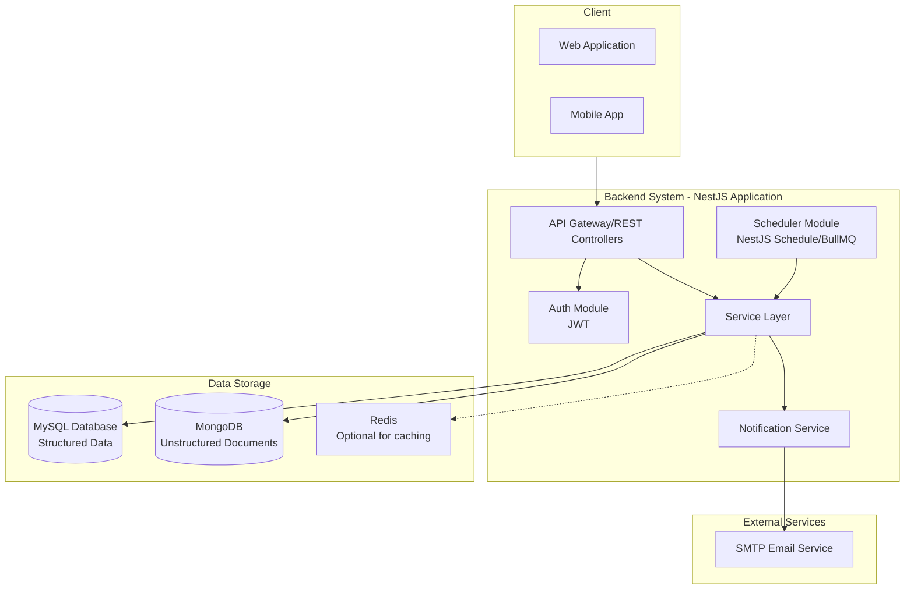
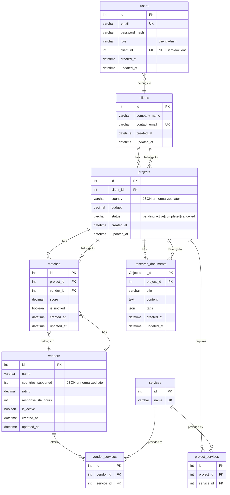
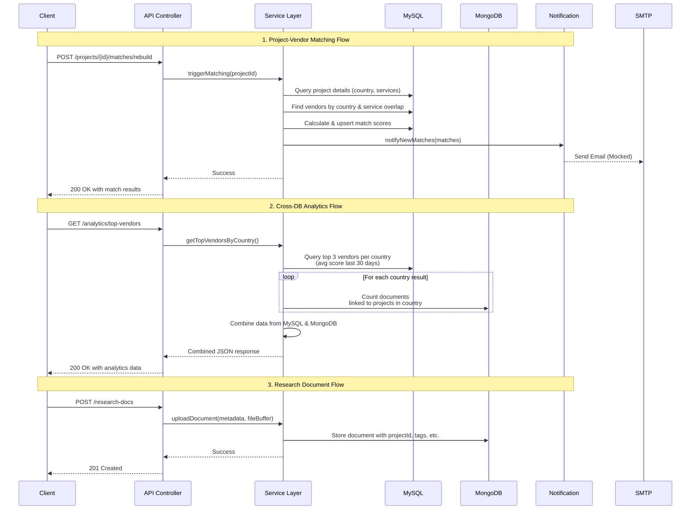
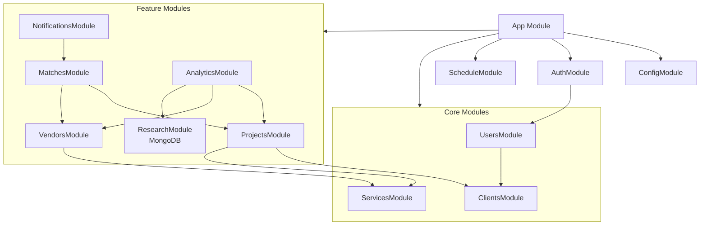

## 1. System Architecture Diagram

This diagram shows the high-level components of the system, their interactions, and the technology stack.

---

## 2. Relational Database (MySQL) Schema Diagram

## 📖 Database Design Description

This database schema is designed to manage **clients, projects, vendors, and their matching process** within the system. It follows a **relational model** using MySQL, with some integrations to MongoDB for unstructured data.

### 🔹 Entities & Relationships

- **Users**:
  Represent system users (clients and admins). Each user is linked to a `client` record if their role is `client`.

- **Clients**:
  Companies or organizations that create projects.
  - A client **has many** projects.

- **Projects**:
  Requests submitted by clients, containing budget, status, and required services.
  - A project **belongs to** one client.
  - A project **requires many** services (via `project_services`).
  - A project **has many** matches with vendors.
  - A project **has many** research documents (stored in MongoDB).

- **Vendors**:
  Service providers that support multiple countries and offer various services.
  - A vendor **offers many** services (via `vendor_services`).
  - A vendor **has many** matches with projects.

- **Services**:
  Standardized list of services offered in the system.
  - A service **is required by many** projects.
  - A service **is offered by many** vendors.

- **Project_Services / Vendor_Services**:
  Many-to-many join tables connecting projects and vendors to the services they need or provide.

- **Matches**:
  Represent the result of the matching logic between a project and a vendor, including the score and notification status.
  - A match **belongs to** one project.
  - A match **belongs to** one vendor.

- **Research_Documents (MongoDB)**:
  Unstructured documents related to projects (e.g., market research, analysis reports). They are stored in MongoDB with flexible schema (tags, text content, etc.).

### 🔹 Design Considerations

- **Services Normalization**: Services are stored in a dedicated table to ensure data integrity and enable efficient querying (e.g., finding all vendors offering a service needed by a project).
- **Countries**: Currently stored as JSON for simplicity, but can be normalized into separate tables if more advanced querying or analytics are required.
- **Hybrid Approach**: Relational data (projects, vendors, matches) is kept in MySQL for strong consistency, while research documents are stored in MongoDB to support flexible and scalable document storage.

📌 This structure provides a clean separation of concerns, supports scalable matching logic, and ensures efficient queries for both transactional operations and analytics.

---

## 3. API Endpoints & Flow Diagram

This sequence diagram illustrates the key API flows, particularly the cross-db analytics and matching processes.

---

## 4. Module/Service Dependency Diagram (NestJS Structure)

This diagram outlines the recommended NestJS module structure and their dependencies.

## 📦 Module Explanations

### 🔹 Core Modules

- **AppModule**
  - Root module of the NestJS application.
  - Imports and wires together all feature and infrastructure modules.

- **ConfigModule**
  - Centralized configuration (e.g., database connections, environment variables).
  - Ensures secrets and environment-specific settings are injected consistently.

- **ScheduleModule**
  - Provides scheduling and background job support (e.g., CRON jobs, BullMQ queues).
  - Used by the Notifications and Matches modules for periodic tasks.

- **AuthModule**
  - Handles authentication (JWT strategy, guards, login, signup).
  - Enforces role-based access (`client`, `admin`).
  - Depends on the `UsersModule` for account validation.

- **UsersModule**
  - Manages user accounts (email, password, role).
  - Provides services to Auth for login/signup.
  - Maintains relations to `Clients` (a client user belongs to one client).

- **ClientsModule**
  - Represents organizations/companies that own projects.
  - Each client can have multiple users and multiple projects.
  - Business-level entity, separate from authentication.

- **ServicesModule**
  - Manages the standardized list of services offered in the system
  - Provides CRUD operations for service entities
  - Used by both `ProjectsModule` (for required services) and `VendorsModule` (for offered services)
  - Ensures data integrity and consistency across service references

### 🔹 Feature Modules

- **ProjectsModule**
  - Manages client projects.
  - Stores project metadata (budget, country, status).
  - Connects to `Clients` (each project belongs to one client).
  - Defines required services via the `project_services` join table.

- **VendorsModule**
  - Manages vendors (service providers).
  - Stores vendor data (countries supported, services offered, SLA, rating).
  - Defines offered services via the `vendor_services` join table.

- **MatchesModule**
  - Core of the matching logic.
  - Creates matches between projects and vendors.
  - Calculates a score based on services overlap, country compatibility, vendor rating, and SLA.
  - Works closely with `Projects` and `Vendors`.

- **ResearchModule (MongoDB)**
  - Handles unstructured project documents (market insights, contracts, reports).
  - Stored in MongoDB for flexibility (tags, text search, variable structures).
  - Each document is linked to a project (`projectId`).

- **AnalyticsModule**
  - Provides aggregated statistics and cross-database queries.
  - Combines MySQL data (projects, vendors, matches) with MongoDB documents.
  - Exposes APIs for dashboards (top vendors, match trends, document counts).

- **NotificationsModule**
  - Sends notifications (e.g., emails, logs, or queued events).
  - Triggered when new matches are generated or scheduled tasks run.
  - Relies on `ScheduleModule` for daily jobs (e.g., refreshing matches, vendor status checks).

---

## Summary of Key Requirements from Diagrams

1. **Authentication & Roles**
   - The `AuthModule` handles authentication with JWT and role-based access control (`client`, `admin`).
   - Authentication depends on the `UsersModule`, which manages user accounts (email, password, role).

2. **User & Client Separation**
   - `UsersModule`: represents system accounts (login credentials, roles).
   - `ClientsModule`: represents business entities (companies/organizations).
   - A `User` with role `client` belongs to one `Client`, while a `Client` can have multiple `Users` (future extensibility).

3. **Data Storage (Hybrid Model)**
   - **MySQL**: Stores structured relational data
     - `Users`, `Clients`, `Projects`, `Vendors`, `Services`, `Matches`
     - Join tables: `project_services`, `vendor_services`

   - **MongoDB**: Stores unstructured documents linked to `projectId`
     - `ResearchDocuments` (market insights, contracts, reports, etc.).

4. **Matching Logic**
   - Implemented in the `MatchesService`.
   - Calculates a **score** for each vendor based on:
     - Service overlap (via normalized join tables).
     - Country compatibility.
     - Vendor rating and SLA.

   - Exposed via an API endpoint (`POST /matches/find`).

5. **Cross-Database Analytics**
   - The `AnalyticsService` aggregates data from both databases:
     - MySQL: vendor/project stats, match counts, service usage.
     - MongoDB: research document counts, tags, usage insights.

   - Provides API endpoints for dashboards and reporting.

6. **Scheduling & Notifications**
   - `ScheduleModule` runs cron jobs / background workers (e.g., BullMQ).
   - Daily jobs refresh matches, flag inactive vendors, or recalculate scores.
   - `NotificationsService` sends alerts (email/log/queue) when new matches are generated or scheduled tasks run.

7. **Deployment**
   - Full system is containerized.
   - `docker-compose.yml` defines services for:
     - `app` (NestJS)
     - `mysql` (relational DB)
     - `mongodb` (document DB)
